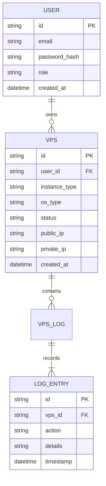

# TECH_SPEC.md

## Technical Specification for dev-vps

### 1. Overview
dev-vps is a managed virtual private server (VPS) service designed to simplify development workflows for developers. It provides scalable, secure, and fully managed infrastructure with automated provisioning, monitoring, and scaling capabilities.

### 2. Architecture Overview
The system follows a microservices architecture with the following components:

```
+----------------+      +----------------+      +----------------+
|   User Portal  | ---> |   Authentication| ---> |   Resource    |
| (Web/CLI)      |      |   Service      |      |   Manager     |
+----------------+      +----------------+      +----------------+
         ^                               ^                               ^
         |                               |                               |
         |                               |                               |
+----------------+      +----------------+      +----------------+
|   API Gateway |      |   VPS Orchestrator|      |   Monitoring   |
| (Load Balancer)|      +----------------+      +----------------+
         ^                               ^                               ^
         |                               |                               |
         |                               |                               |
+----------------+      +----------------+      +----------------+
|   Database    |      |   Compute Nodes |      |   Logging      |
| (PostgreSQL)  |      +----------------+      +----------------+
```

### 3. Components

#### 3.1 User Portal
- **Technology**: React (frontend), Node.js (backend), TypeScript
- **Responsibilities**:
  - User authentication and authorization
  - VPS creation, configuration, and management UI
  - Billing and subscription management
  - Dashboard with resource usage metrics

#### 3.2 Authentication Service
- **Technology**: OAuth 2.0, JWT tokens
- **Responsibilities**:
  - User registration and login
  - Role-based access control (RBAC)
  - Session management and token validation

#### 3.3 VPS Orchestrator
- **Technology**: Python (Docker), Kubernetes (optional)
- **Responsibilities**:
  - VPS lifecycle management (create, start, stop, delete)
  - Resource allocation (CPU, RAM, storage)
  - Automated provisioning with cloud provider APIs
  - Scaling policies based on load

#### 3.4 Monitoring Service
- **Technology**: Prometheus, Grafana, ELK stack
- **Responsibilities**:
  - Real-time performance metrics collection
  - Alerting and notifications
  - Historical data storage and analysis

#### 3.5 Database
- **Technology**: PostgreSQL
- **Responsibilities**:
  - User data, VPS configurations, billing records
  - Secure data storage with encryption at rest

### 4. Data Model

#### 4.1 Core Entities


### 5. Key APIs & Interfaces

#### 5.1 REST API Endpoints
- `POST /api/v1/users/register` - User registration
- `POST /api/v1/users/login` - User authentication
- `GET /api/v1/users/profile` - User profile retrieval
- `POST /api/v1/vps/create` - Create new VPS instance
- `GET /api/v1/vps/list` - List all VPS instances
- `POST /api/v1/vps/{id}/start` - Start VPS
- `POST /api/v1/vps/{id}/stop` - Stop VPS
- `GET /api/v1/vps/{id}/logs` - Get VPS logs

#### 5.2 WebSockets
- Real-time notifications for VPS status changes
- Live monitoring metrics streaming

### 6. Technology Stack

| Layer | Technology | Reason |
|-------|------------|--------|
| Front
